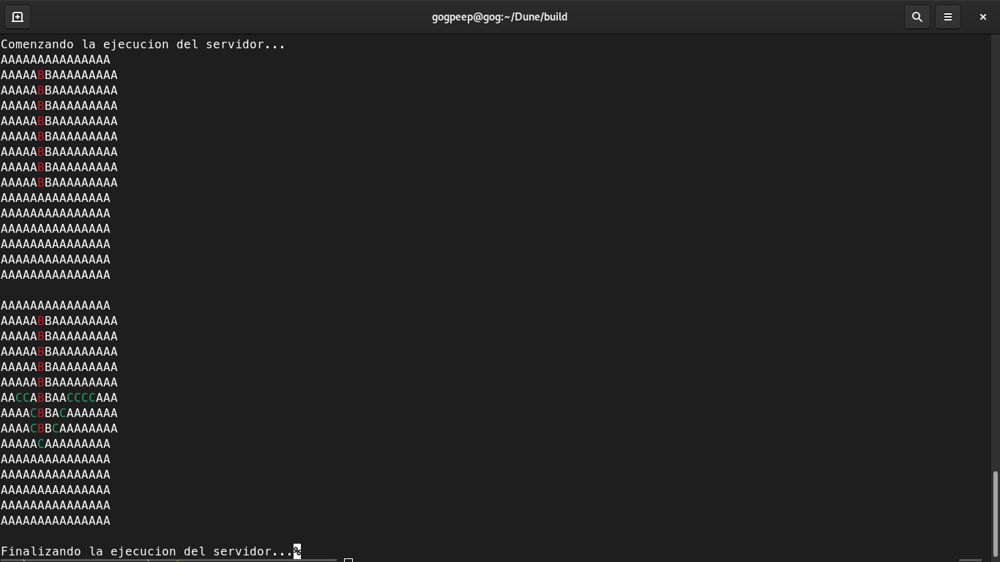

# Dune

Dune es un juego de estrategia en tiempo real basado en el icónico juego Dune 2000 de Westwood Studios
del año 1998 ambientado en la novela Dune de Frank Herbert.

| Integrantes        | Padron |
|--------------------|--------|
| Ledesma, Dylan     | 102876 |
| Riluizaga, Ricardo | 87528  |
| Codino, Federico   |        |

## Compilar el proyecto:
    > sudo ./installer.sh

## To do
### Server
    1> Mapa con distintos terrenos
    2> Unidades con distintas movilidades
    3> Ataque y destruccion de unidades y edificaciones

    4> Procesar informacion de la nueva conexion
    5> Enviarle la lista de la partidas actuales
### Cliente
    1> Debe enviar la informacion del nuevo jugador:
         * Nombre
         * Casa con la que jugará
    2> Permitir elegirle al jugador si quiere crear o unirse a una partida (el server ya la debe haber podido enviar la lista de partidas actuales que hay creadas)

## Evolucion del Proyecto

### Server
#### Algoritmo A*
* A representa el terreno Arena
* B representa posiciones bloqueadas en el mapa
* C representa el camino que tomo la unidad para llegar a destino

